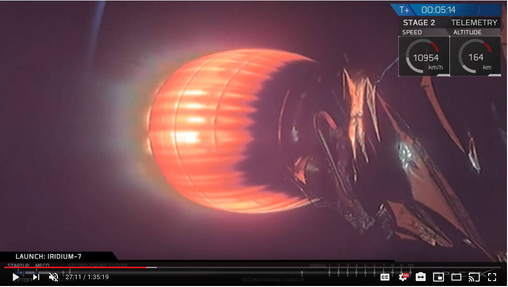

# The goal of this project is to use video from the SpaceX launches to figure out the acceleration that the rockets are enduring at any given moment and then display that information in a useful manner.

Tasks that this project will have to solve:
* Get the raw spacex videos
* Convert videos to frames (potentially simply in memory, instead of serialized to HD)
* Locate digits related to velocity. In this case we can likely crop the bottom left of the screen
* OCR to classify the digits related to velocity and stitch together to actual speed value
* Make a log of time/speed values
* Visualize:
  * First pass would simply be EDA from different launches. Plot time w/ velocity and acceleration
  * Second pass, use visualization to make masks that overlay the launch video and show the current acceleration

### Get the raw spacex videos:

TBD

### Convert the videos to frames

TBD

### Locate digits/OCR

These two would be solved through a combination of ML and subject familiarity (ie the speed in the SpaceX launch videos is in the upper right portion of the screen, or lower left of the screen more recently.)

The first approach that I will take in solving this is to try to use transfer learning from another ML model.  In this case I plan to train a model on the Street View House Numbers dataset which is annotated for location of numbers as well as the values.  Once I have a model working on that dataset with reasonable performance then the plan is to annotate a smaller set of SpaceX speed numbers and then fine tune the model on this application specific dataset.  At this point we should have a reasonably good solution for extracting the speed numbers from the video frames.  

It may also be of value to extract the time value in the video, which is typically time since lift off.  This value in conjunction with frame number should give us a time value accurate to +/- ~0.04s. (This will depend on the frame rate of the original video, etc.)

One potential issue that has not yet been explored is for the least significant digit of speed it can change very rapidly.  At this time it is not clear if the numbers in the video frames are blurred or if it's simply an artifact of the youtube rendering/frame rate. (The latter seems more likely but EDA will clarify.)

### Make a log of the data

Trivial

### Visualize

* First Pass: Trivial

* Second Pass: Modify plots to be transparent and then overlay on top of the original video, if it seems worthwhile.

### References:

* Yuval Netzer, Tao Wang, Adam Coates, Alessandro Bissacco, Bo Wu, Andrew Y. Ng Reading Digits in Natural Images with Unsupervised Feature Learning NIPS Workshop on Deep Learning and Unsupervised Feature Learning 2011. http://ufldl.stanford.edu/housenumbers/
